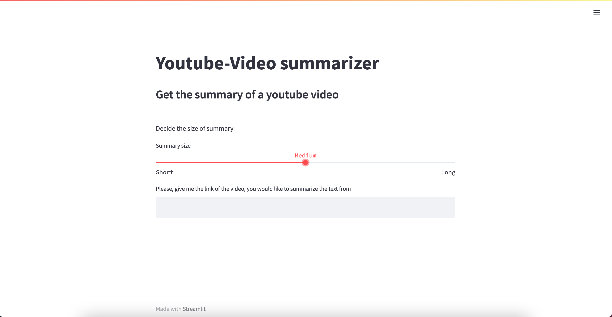

# YOUTUBE VIDEO SUMMARIZER

## Overview

Every day people spend hours watching Youtube videos, and not always they are happy with what they consume,
but they do not realize it immediately, maybe only after 10, 20 minutes, sometimes even 30 people recognize
that they are not interested in what they are watching.
Especially when the object we are speaking about is a very long video, regarding a complex or structured topic.

Since I am a frequent Youtube user I've thought about something that could solve this problem.
Therefore for my final project, I created a video Youtube summarizer with GPT-3.

## How it works

This project offers tools to read and visualize insights from a Youtube video to analyze the content
and decide if it is something interesting for us.
The code is deployed on a local Streamlit page, as you can see in the image below, after inserting the link,
using YoutubeTranscriptAPI we get the text from the video.
Then using GPT-3 we summarize and analyze the sentiment of the original transcript.
After sentiment's chart, a word cloud, and the summary, there is a gif of an ASL translation (currently the gif is composed just translating every char in ASL),
and last but not least there is an audio created with the gTTS library.

## Background: What is GPT-3

GPT-3, or the third generation Generative Pre-trained Transformer, is a neural network machine learning model trained using internet data to generate any type of text. Developed by OpenAI, it requires a small amount of input text to generate large volumes of relevant and sophisticated machine-generated text.

GPT-3's deep learning neural network is a model with over 175 billion machine learning parameters. As of early 2021, GPT-3 is the largest neural network ever produced. As a result, GPT-3 is better than any prior model for producing text that is convincing enough to seem like a human could have written it.

## To use locally:

- clone this repo
- get api key from Open-AI and store in a file called keys.py using the name OPENAI_API_KEY
- pip install requirements.txt
- wait a little while....
- In the directory you cloned digit in the terminal "streamlit run youtube_summerizer.py"
- In your browser should open automatically the page with the Youtube video summarizer

## To Do:

- tests
- new feature: improve the ASL translator (Pose recognition with trasfer learning to a 3D figure)

## Sources and further reading:

- Language Models are Few-Shot Learners (Open-AI)

* [GPT-3](https://openai.com/blog/gpt-3-apps/)
* [OPEN-AI](https://openai.com)
* [gTTS](https://pypi.org/project/gTTS/)
* [STREAMLIT](https://streamlit.io)

This project has been developed as a final project @Spiced Bootcamp.

MIT License
